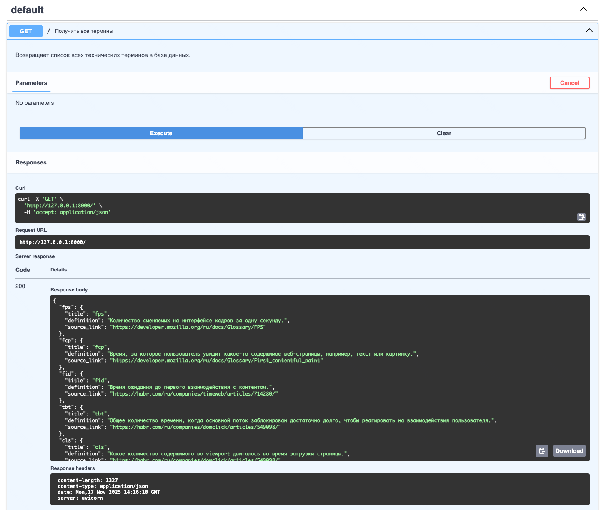
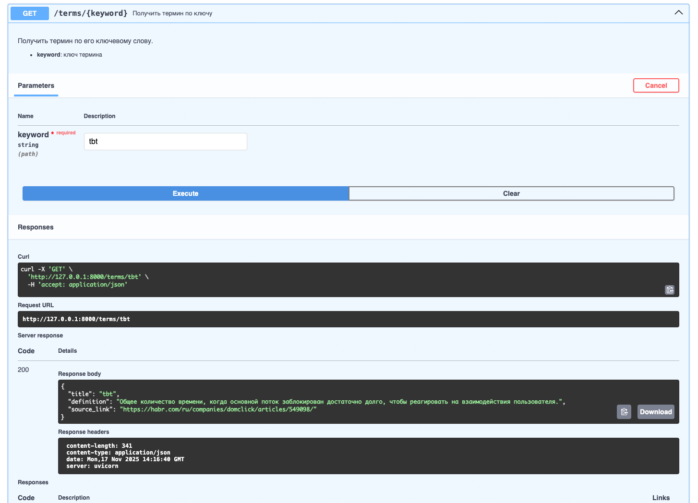
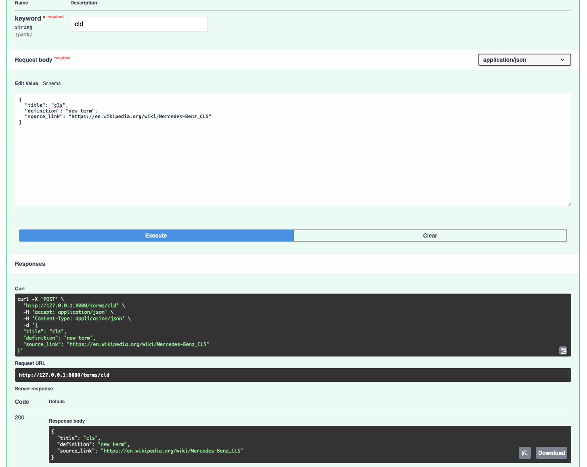
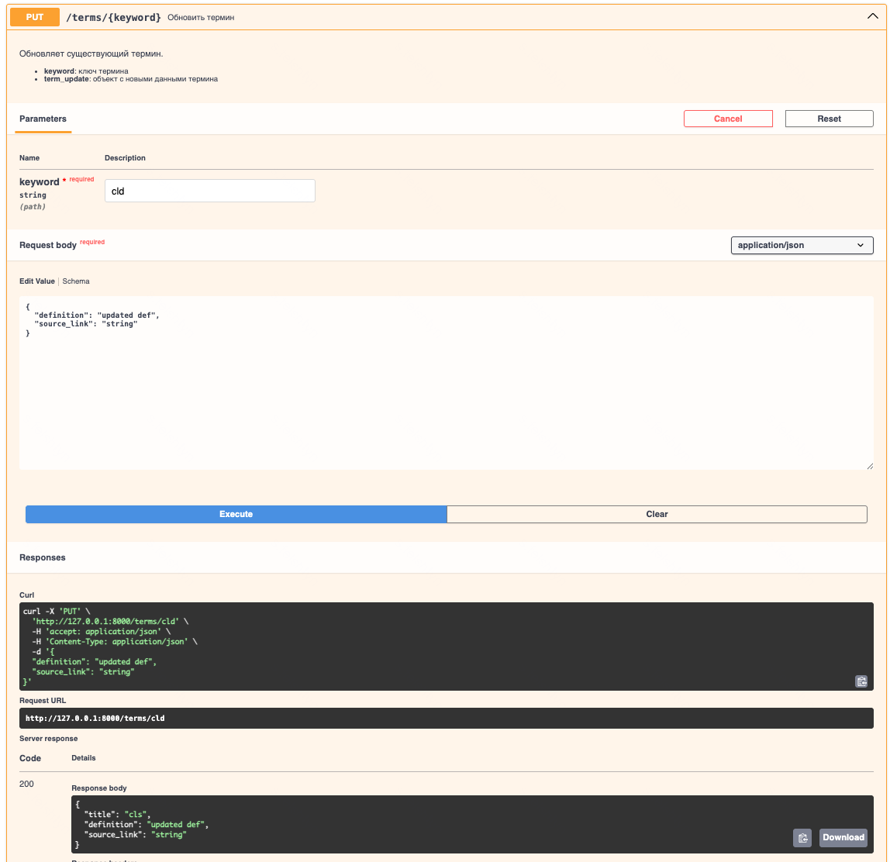
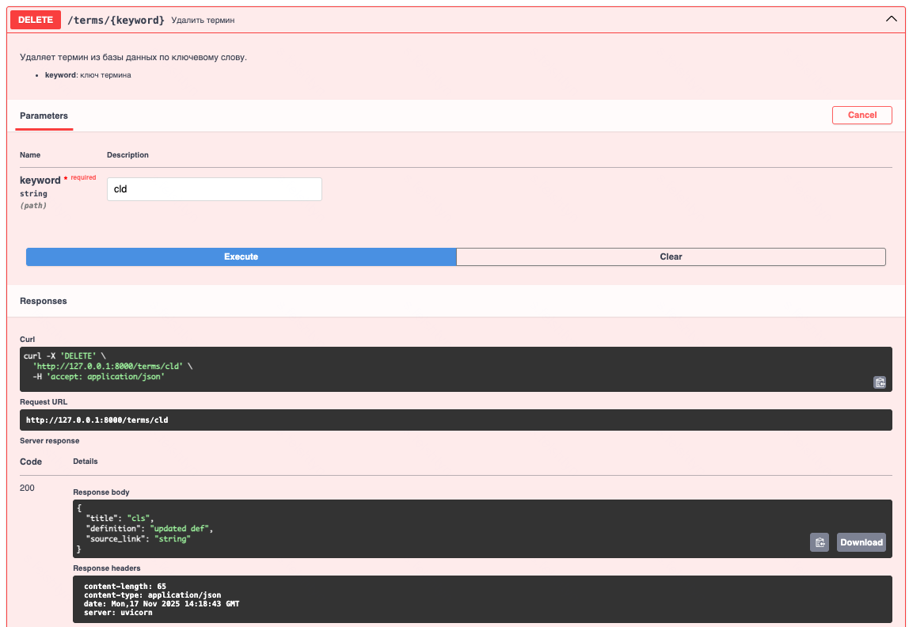
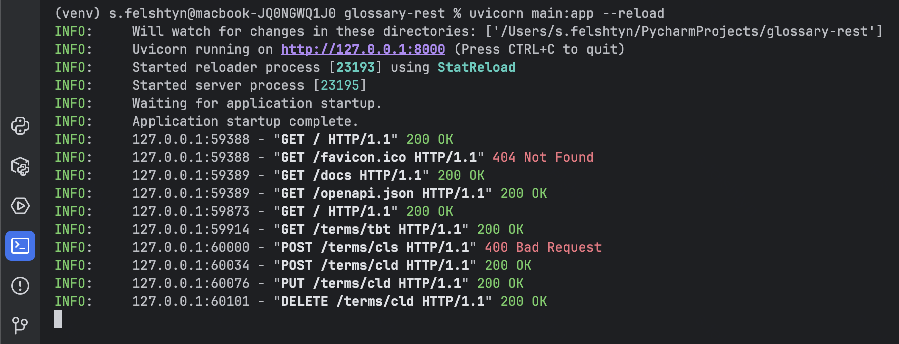

# Tech Terms API

API для управления техническими терминами и их определениями.  
Реализовано на FastAPI с документацией Swagger.

---

## 🚀 Запуск приложения

**Создать и активировать виртуальное окружение:**

```bash
python -m venv venv
source venv/bin/activate   # macOS/Linux
# venv\Scripts\activate    # Windows
```

**Установка зависимостей**
```bash
pip install --upgrade pip setuptools wheel
pip install --prefer-binary -r requirements.txt
```

**Запуск:**
```bash
python -m uvicorn main:app --reload
```

📦 Эндпоинты
1. Получить все термины

**Пример curl:**

```bash
curl -X GET http://localhost:8000/
```



2. Получить термин по ключу

URL: /terms/{keyword}

Метод: GET

Пример curl:

```bash
curl -X GET http://localhost:8000/terms/fps
```

Пример ответа:


3. Создать новый термин

URL: /terms/{keyword}

Метод: POST

Пример curl:

```bash
curl -X POST http://localhost:8000/terms/lcp \
-H "Content-Type: application/json" \
-d '{
  "title": "lcp",
  "definition": "Время загрузки основного содержимого страницы.",
  "source_link": "https://developer.mozilla.org/ru/docs/Glossary/Largest_contentful_paint"
}'
```


Пример ответа:



4. Обновить термин

URL: /terms/{keyword}

Метод: PUT

Пример curl:

```bash
curl -X PUT http://localhost:8000/terms/lcp \
-H "Content-Type: application/json" \
-d '{
  "definition": "Время, за которое загружается основное содержимое страницы."
}'
```


Пример ответа:


5. Удалить термин

URL: /terms/{keyword}

Пример curl:

```bash
curl -X DELETE http://localhost:8000/terms/lcp
```

Пример ответа:


Логи приложения:
